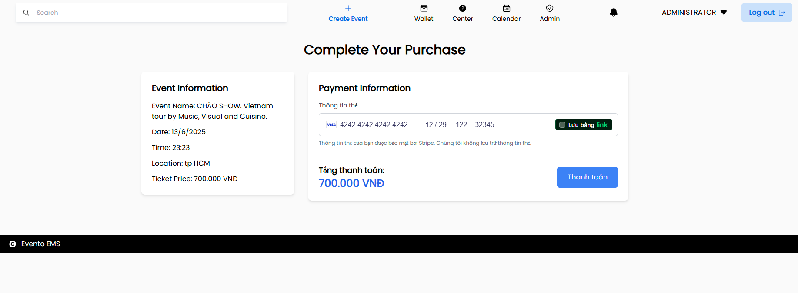
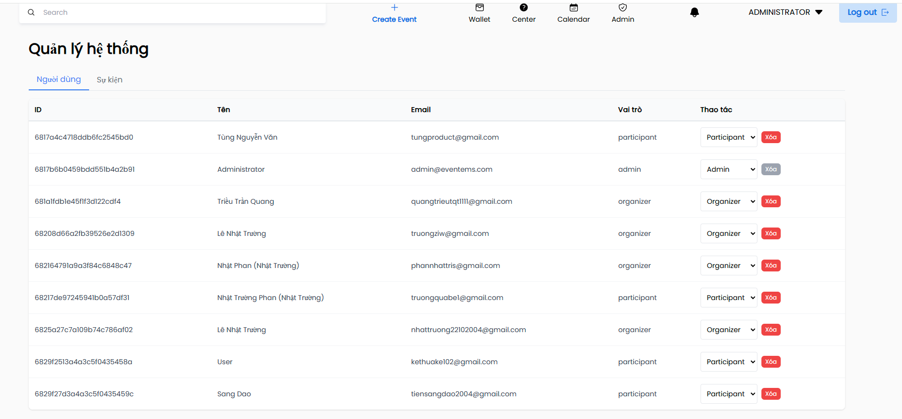
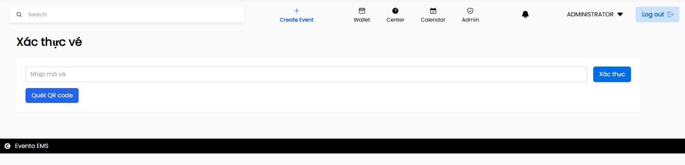
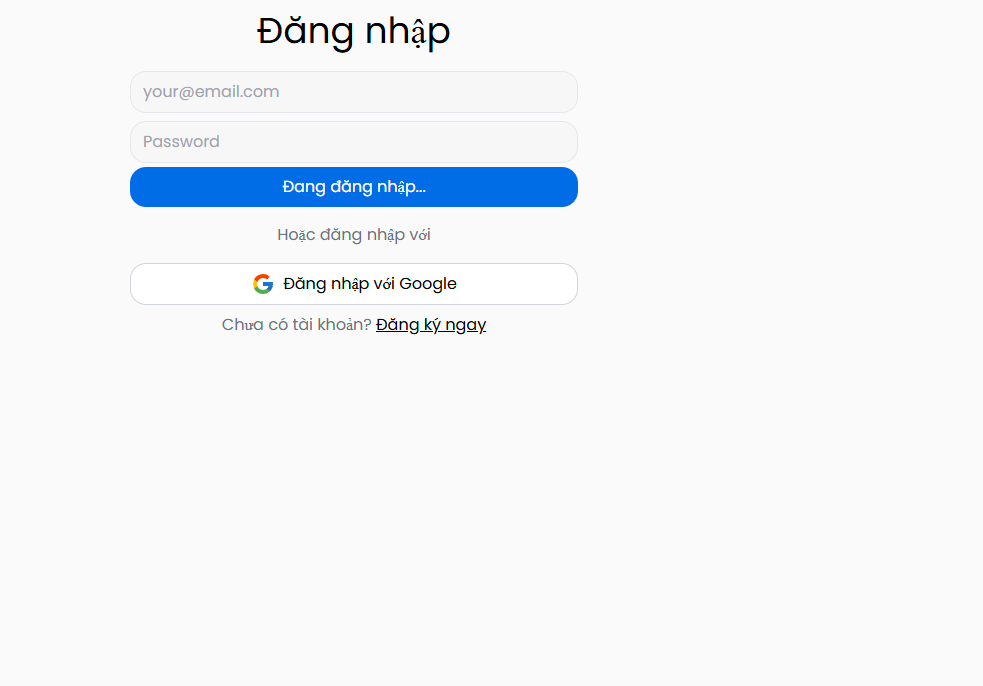

# EventoEMS - Event Management System

Giới thiệu hệ thống quản lý sự kiện của chúng tôi, một giải pháp được phát triển như một phần của dự án nhóm năm cuối, nhằm tối ưu hóa việc lập kế hoạch, đăng ký và đặt vé cho các sự kiện trong khuôn viên trường. Tôi đóng vai trò quan trọng với tư cách là kiến trúc sư, thiết kế giao diện người dùng với các nguyên tắc thiết kế hiện đại và ưu tiên trải nghiệm người dùng. Chúng tôi đang phát triển hệ thống bằng MERN stack (MongoDB, Express.js, React.js, Node.js) và áp dụng phương pháp Agile Scrum để phát triển hiệu quả.

## Thông tin nhóm 

- Trần Quang Triều - 22002955 
- Phan Nhật Trường - 22721621
- Nguyễn Văn Tùng - 22647011
- Lê Nhật Trường - 22716321

## 🎥 Video Demo

https://drive.google.com/drive/folders/16GO2YQDdHmfMhj7GvNchhMP924jJBaLf?usp=sharing

## Features

- Lên lịch sự kiện
- Xem các sự kiện sắp tới
- Xem lịch sự kiện
- Phê duyệt sự kiện
- Đặt vé tham gia sự kiện
- Tạo mã QR để nhận vé
- Thanh toán trực tuyến với Stripe
- Xác thực SMS cho đặt vé
- Quản lý người dùng với hệ thống phân quyền
- Đăng nhập/Đăng ký với Firebase Authentication
- Quét mã QR để xác thực vé tại sự kiện

**Thiết kế giao diện:**
- Trang chủ: hiển thị danh sách sự kiện, thanh tìm kiếm


- Trang chi tiết sự kiện: thông tin đầy đủ, nút đăng ký


- Trang thanh toán: form thông tin, Stripe Elements


- Dashboard admin: bảng quản lý người dùng và sự kiện


- Trang quét QR: camera scanner, hiển thị kết quả


- Trang đăng nhập/đăng ký: Login form với email/password, Google OAuth\


## Yêu Cầu

- Node.js và npm
- Tài khoản MongoDB Atlas (cơ sở dữ liệu đám mây)
- Tài khoản Stripe (để xử lý thanh toán)
- Tài khoản Twilio (để gửi SMS xác thực)
- Tài khoản Firebase (để xác thực người dùng)

## Cài đặt

### Clone repository về
```bash
git clone https://github.com/your-username/Event-Management-System.git
cd Event-Management-System
```

### Thiết lập MongoDB Atlas:

1. Đăng ký tài khoản tại MongoDB Atlas
2. Tạo một cluster mới 
3. Thiết lập user database và mật khẩu
4. Thêm địa chỉ IP của bạn vào whitelist 
5. Lấy chuỗi kết nối bằng cách nhấp vào "Connect" > "Connect your application"

### Thiết lập Firebase:

1. Tạo dự án trên Firebase Console
2. Bật tính năng Authentication, chọn Email/Password và Google làm phương thức đăng nhập
3. Tạo Web App và tải xuống cấu hình
4. Tạo và tải về file service account từ Project Settings > Service accounts

### Thiết lập Stripe và Twilio:

1. Đăng ký tài khoản Stripe và Twilio
2. Lấy API keys từ dashboard của mỗi dịch vụ

### Cấu hình phía Backend:
```bash
cd api
npm install
```

Tạo file `.env` trong thư mục api với nội dung từ file `.env.example` 

Copy file service account Firebase vào thư mục api với tên `serviceAccountKey.json`

### Cấu hình phía Frontend:
```bash
cd client
npm install
```

### Start the server:
```bash
cd api
nodemon index.js
```

### Start the Client trong terminal khác:
```bash
cd client
npm run dev
```
**Ứng dụng sẽ chạy tại: http://localhost:5173**<br>
**Máy chủ đang chạy tại: http://localhost:4000**

## Chạy với Docker
Nếu bạn muốn sử dụng Docker thay vì cài đặt thủ công:

```bash
docker-compose up --build
```

Hoặc sử dụng script:
```bash
.\deploy-docker.bat
```

**Hệ thống phân quyền**
* Hệ thống có 3 vai trò người dùng:

**Admin**

* Quản lý tất cả người dùng và sự kiện
* Phê duyệt sự kiện
* Xem thống kê hệ thống
* Xác thực vé

**Organizer**

* Tạo và quản lý sự kiện của mình
* Xác thực vé tại sự kiện
* Xem danh sách người tham gia

**Participant**

* Xem và đăng ký tham gia sự kiện
* Mua vé và thanh toán
* Xem lịch sử vé đã mua
* Tài khoản mặc định

**Tài khoản mặc định**
* Hệ thống tự động tạo tài khoản admin khi khởi động:
* Email: admin@eventems.com
* Password: admin123

**Kiểm thử thanh toán với Stripe**
* Khi test hệ thống thanh toán, sử dụng thẻ test của Stripe:
* Số thẻ: 4242 4242 4242 4242
* Ngày hết hạn: Bất kỳ ngày nào trong tương lai
* CVC: Bất kỳ 3 số nào
* ZIP: Bất kỳ 5 số nào