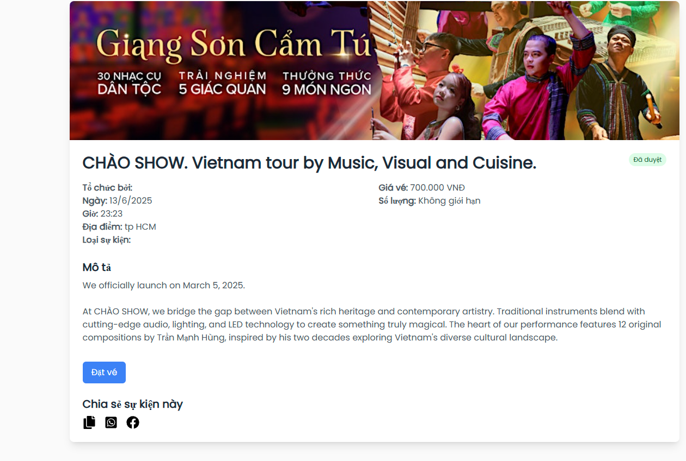
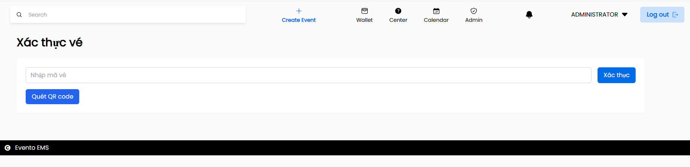
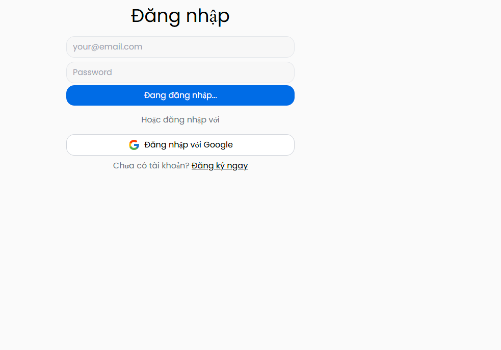

# EVENTEMS - EVENT MANAGEMENT SYSTEM

## 1. THÔNG TIN NHÓM

- Trần Quang Triều - 22002955 - quangtrieutqt1111@gmail.com 
- Phan Nhật Trường - 22721621 - phannhattris@gmail.com 
- Nguyễn Văn Tùng - 22647011 - tungproduct@gmail.com 
- Lê Nhật Trường - 22716321 - nhattruong22102004@gmail.com 

### Phân công công việc

**Phan Nhật Trường**
- Phát triển tính năng tạo sự kiện
- Docker hóa ứng dụng

**Trần Quang Triều**
- Xây dựng giao diện trang chủ, xem sự kiện sắp tới
- Tích hợp thanh toán online với Stripe khi đặt vé

**Nguyễn Văn Tùng**
- Xử lý đặt vé sự kiện
- Tích hợp xác thực SMS với Twilio

**Lê Nhật Trường**
- Xây dựng trang quản trị (admin) để quản lý người dùng/sự kiện
- Tích hợp Firebase Authentication (Email/Password + Google) cho đăng nhập/đăng ký


## 2. MÔ TẢ ĐỀ TÀI

### 2.1. Mô tả tổng quan
EventoEMS (Event Management System) là một hệ thống quản lý sự kiện toàn diện được phát triển nhằm giải quyết các vấn đề trong việc tổ chức, quản lý và tham gia sự kiện. Hệ thống được xây dựng với kiến trúc MERN stack (MongoDB, Express.js, React.js, Node.js) kết hợp với các dịch vụ đám mây hiện đại.

**Vấn đề cần giải quyết:**
- Khó khăn trong việc quản lý thông tin sự kiện một cách tập trung
- Quy trình đăng ký và bán vé sự kiện thủ công, thiếu hiệu quả
- Không có hệ thống thanh toán trực tuyến an toàn
- Thiếu công cụ xác thực vé điện tử hiện đại
- Khó khăn trong việc theo dõi và quản lý người tham gia

**Lý do chọn đề tài:**
- Ứng dụng thực tế cao 
- Tích hợp nhiều công nghệ hiện đại 
- Cơ hội học hỏi về phát triển full-stack và DevOps
- Đáp ứng nhu cầu thực tế 

### 2.2. Mục tiêu
- Phát triển một hệ thống quản lý sự kiện hoàn chỉnh với giao diện thân thiện
- Tự động hóa quy trình đăng ký, bán vé và quản lý người tham gia
- Tích hợp hệ thống thanh toán trực tuyến an toàn với Stripe
- Triển khai hệ thống xác thực vé bằng mã QR
- Xây dựng hệ thống phân quyền người dùng linh hoạt (Admin, Organizer, Participant)
- Đảm bảo khả năng mở rộng và bảo mật cao
- Triển khai ứng dụng bằng Docker để dễ dàng deployment
- Tích hợp các dịch vụ đám mây (Firebase, MongoDB Atlas, Twilio)

## 3. PHÂN TÍCH THIẾT KẾ

### 3.1. Phân tích yêu cầu

**Các yêu cầu chức năng:**
- **Quản lý người dùng:** Đăng ký, đăng nhập, phân quyền (Admin/Organizer/Participant)
- **Quản lý sự kiện:** Tạo, xóa, phê duyệt sự kiện
- **Hệ thống đặt vé:** Đăng ký tham gia, thanh toán trực tuyến, tạo vé điện tử
- **Quản lý thanh toán:** Tích hợp Stripe, xử lý giao dịch an toàn
- **Xác thực vé:** Tạo mã QR, quét mã QR để xác thực
- **Thông báo:** SMS xác thực qua Twilio

**Các yêu cầu phi chức năng:**
- **Bảo mật:** Xác thực Firebase, mã hóa dữ liệu, bảo mật API
- **Hiệu năng:** Thời gian phản hồi nhanh, xử lý đồng thời nhiều người dùng
- **Khả năng mở rộng:** Kiến trúc microservices, triển khai Docker
- **Tương thích:** Responsive design, hỗ trợ đa trình duyệt
- **Bảo trì:** Code clean, documentation đầy đủ,

### 3.2. Đặc tả yêu cầu

**Đặc tả chức năng chính:**

1. **Hệ thống xác thực người dùng**
   - Firebase Authentication với email/password và Google OAuth
   - JWT tokens cho session management
   - Hệ thống phân quyền 3 cấp: Admin, Organizer, Participant

2. **Quản lý sự kiện**
   - CRUD operations cho events
   - Upload và quản lý hình ảnh sự kiện
   - Workflow phê duyệt sự kiện (Admin approval)
   - Calendar view và timeline view

3. **Hệ thống đặt vé và thanh toán**
   - Stripe cho thanh toán thẻ tín dụng
   - QR code cho mỗi vé
   - SMS confirmation 
   
4. **Xác thực vé bằng mã QR**
   - Sử dụng camera để quét mã QR
   - Hiển thị thông tin vé và trạng thái (valid/used/expired)
   - Cập nhật trạng thái vé khi quét

### 3.3. Thiết kế hệ thống

**Kiến trúc hệ thống:**
```
              +---------------------+         
              |     Web Browser     |          
              +---------------------+          
                        |
                        v
            +---------------------------+
            |      React.js Frontend    |
            +---------------------------+
                        |
                        v
            +---------------------------+
            |    Nginx (Reverse Proxy)  |
            +---------------------------+
                        |
                        v
        +--------------------------------------+
        |       Express.js API Server          |
        +--------------------------------------+
         |           |               |        
         v           v               v
+----------------+ +----------------+ +------------------+
| Auth Middleware| | Role Middleware| | File Upload Svc  |
+----------------+ +----------------+ +------------------+
                        |
                        v
+---------------------+     +-------------------------+
|    MongoDB Atlas    |     | Local File Storage      |
+---------------------+     +-------------------------+

          External Integrations:
         +-----------+  +-----------+  +-----------+
         |  Firebase |  |  Stripe   |  |  Twilio   |
         +-----------+  +-----------+  +-----------+
               ^              ^              ^
               |              |              |
      +--------+--------------+--------------+--------+
      |                                           |
+---------------------+                +---------------------+
| React.js Frontend   |                | Express.js API      |
+---------------------+                +---------------------+

          Deployment:
+---------------------+     +--------------------------+
|     Docker          | <---> Docker Compose           |
+---------------------+     +--------------------------+

```

**Thiết kế CSDL MongoDB:**
- Collection Users: {_id, uid, name, email, role, createdAt}
- Collection Events: {_id, title, description, eventDate, location, organizer, isApproved, image}
- Collection Tickets: {_id, userid, eventId, ticketId, ticketDetails, qrCode, isUsed}

**Thiết kế giao diện:**
- Trang chủ: hiển thị danh sách sự kiện, thanh tìm kiếm


- Trang chi tiết sự kiện: thông tin đầy đủ, nút đăng ký


- Trang thanh toán: form thông tin, Stripe Elements


- Dashboard admin: bảng quản lý người dùng và sự kiện


- Trang quét QR: camera scanner, hiển thị kết quả


- Trang đăng nhập/đăng ký: Login form với email/password, Google OAuth\



## 4. CÔNG CỤ VÀ CÔNG NGHỆ SỬ DỤNG

**Frontend:**
- Ngôn ngữ lập trình: JavaScript 
- Framework: React.js 18
- UI Framework: Tailwind CSS
- Routing: React Router v6
- HTTP Client: Axios
- Build Tool: Vite

**Backend:**
- Ngôn ngữ lập trình: JavaScript (Node.js)
- Framework: Express.js
- Authentication: Firebase Authentication
- Database: MongoDB Atlas (NoSQL)
- Payment: Stripe API
- SMS Service: Twilio API

**DevOps & Deployment:**
- **Docker:** Containerization
- **Docker Compose:** Multi-container orchestration
- **Git:** Version control system
- **GitHub:** Code repository hosting

**IDE & Tools:**
- Visual Studio Code
- MongoDB Compass
- Firebase Console
- Stripe Dashboard

## 5. TRIỂN KHAI

### 5.1. Cài đặt môi trường development

**Yêu cầu hệ thống:**
- Node.js v18+ và npm
- MongoDB Atlas
- Git

**Bước 1: Clone repository**
```bash
git clone https://github.com/your-username/EventoEMS.git
cd EventoEMS
```

**Bước 2: Thiết lập Backend**
```bash
cd api
npm install
```

Tạo file `.env` với các biến môi trường:

**Bước 3: Thiết lập Frontend**
```bash
cd client
npm install
```

**Bước 4: Chạy ứng dụng**
```bash
# Terminal 1 - Backend
cd api
npm start

# Terminal 2 - Frontend  
cd client
npm run dev
```

### 5.2. Triển khai bằng Docker

**Sử dụng Docker Compose:**
```bash
docker-compose up --build
```

**Hoặc sử dụng script tự động:**
```bash
.\deploy-docker.bat  
```

### 5.3. Cấu hình dịch vụ bên ngoài

**Firebase Setup:**
1. Tạo project trên Firebase Console
2. Enable Authentication (Email/Password + Google)
3. Tạo Web App và download config
4. Tạo Service Account key và lưu vào `api/serviceAccountKey.json`

**Stripe Setup:**
1. Đăng ký tài khoản Stripe
2. Lấy API keys từ Dashboard
3. Cấu hình webhook endpoints

**Twilio Setup:**
1. Đăng ký tài khoản Twilio
2. Lấy Account SID, Auth Token và Phone Number
3. Cấu hình messaging service

**MongoDB Atlas Setup:**
1. Tạo cluster MongoDB Atlas
2. Thiết lập network access và database user
3. Lấy connection string

## 6. KIỂM THỬ

### 6.1. Kiểm thử chức năng (Functional Testing)

**Authentication Testing:**
- Đăng ký tài khoản mới với email/password
- Đăng nhập với Google OAuth
- Kiểm tra phân quyền (Admin, Organizer, Participant)
- Logout và session management

**Event Management Testing:**
- Tạo sự kiện mới (Organizer)
- Upload và hiển thị hình ảnh sự kiện
- Phê duyệt sự kiện (Admin)
- Chỉnh sửa và xóa sự kiện

**Booking và Payment Testing:**
- Đăng ký tham gia sự kiện
- Thanh toán với thẻ test Stripe (4242 4242 4242 4242)
- Nhận SMS confirmation via Twilio
- Tạo và hiển thị QR code vé

**QR Code Verification Testing:**
- Scan QR code để xác thực vé
- Kiểm tra trạng thái vé (valid/used/expired)
- Update attendance status

## 7. KẾT QUẢ

### 7.1. Kết quả đạt được

**Hệ thống hoàn chỉnh:**
- ✅ Web app hoạt động ổn định
- ✅ Giao diện hiện đại
- ✅ Đăng nhập bằng Email/Password và Google OAuth
- ✅ Phân quyền rõ ràng: Admin, Organizer, Participant

**Tính năng chính:**
- ✅ Tạo và quản lý sự kiện
- ✅ Đặt vé, thanh toán trực tuyến qua Stripe
- ✅ Mã QR xác thực vé
- ✅ Gửi SMS qua Twilio

**Triển khai & tài liệu:**
- ✅ Container hóa với Docker + Docker Compose
- ✅ Cơ sở dữ liệu MongoDB Atlas (cloud)
- ✅ README.md chi tiết, tài liệu API đầy đủ
- ✅ Comment code rõ ràng, kiến trúc sạch
- ✅ Hướng dẫn triển khai

---

### 7.2. Kết quả chưa đạt được

**Tính năng nâng cao:**
- ❌ Chưa có email thông báo (chỉ có SMS)
- ❌ Chưa có biểu đồ/thống kê nâng cao
- ❌ Chưa hỗ trợ đa ngôn ngữ (chỉ tiếng Việt)
- ❌ Chưa có chat/messaging real-time

**Tối ưu hiệu năng:**
- ❌ Chưa có pipeline tối ưu ảnh
- ❌ Chưa có caching layer (Redis)
- ❌ Chưa tích hợp CDN
- ❌ Chưa tối ưu truy vấn DB toàn diện

**Tính năng production:**
- ❌ Chưa có hệ thống monitoring/logging (ELK stack)
- ❌ Chưa cấu hình auto-scaling
- ❌ Chưa có kế hoạch backup & khôi phục
- ❌ Chưa có setup load balancer
- ❌ Chưa có CI/CD pipeline tự động

### 7.3. Hướng phát triển

**Ngắn hạn (1-3 tháng):**
- Thêm email notifications
- Implement caching layer với Redis
- Viết unit tests và integration tests
- Setup monitoring với Prometheus/Grafana

**Trung hạn (3-6 tháng):**
- Phát triển mobile app với React Native
- Thêm tính năng livestream events
- Advanced analytics dashboard
- Multi-tenant architecture

**Dài hạn (6-12 tháng):**
- Machine learning cho event recommendations
- Blockchain integration cho ticket verification
- Microservices architecture
- Global expansion với multi-region deployment

**Mở rộng tính năng:**
- Integration với calendar apps (Google Calendar, Outlook)
- Social media sharing và marketing tools
- Advanced reporting và business intelligence
- White-label solution cho các tổ chức khác

## 8. TÀI LIỆU THAM KHẢO

**Công nghệ và Framework:**
- [React.js Official Documentation](https://react.dev/)
- [Node.js Documentation](https://nodejs.org/docs/)
- [Express.js Guide](https://expressjs.com/)
- [MongoDB Manual](https://www.mongodb.com/docs/)
- [Mongoose ODM](https://mongoosejs.com/docs/)

**Dịch vụ tích hợp:**
- [Firebase Authentication](https://firebase.google.com/docs/auth)
- [Stripe API Documentation](https://stripe.com/docs/api)
- [Twilio SMS API](https://www.twilio.com/docs/sms)
- [MongoDB Atlas](https://www.mongodb.com/atlas)

**DevOps và Deployment:**
- [Docker Documentation](https://docs.docker.com/)
- [Docker Compose](https://docs.docker.com/compose/)
- [Vite Build Tool](https://vitejs.dev/)

**UI/UX Design:**
- [Tailwind CSS](https://tailwindcss.com/docs)
- [React Router](https://reactrouter.com/)
- [Material Design Guidelines](https://material.io/design)

**Best Practices:**
- [REST API Design Guidelines](https://restfulapi.net/)
- [JavaScript Style Guide - Airbnb](https://github.com/airbnb/javascript)
- [React Best Practices](https://react.dev/learn/thinking-in-react)
- [Node.js Security Best Practices](https://nodejs.org/en/docs/guides/security/)

